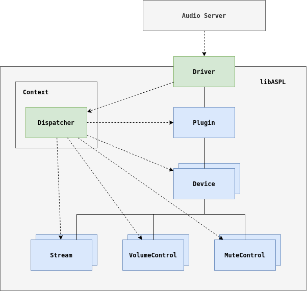
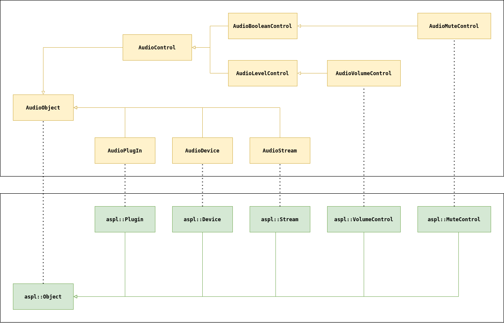

# libASPL [](https://github.com/gavv/libASPL/actions) [](https://gavv.github.io/libASPL/) [](LICENSE)

<!-- toc -->

- [Synopsis](#synopsis)
- [Instructions](#instructions)
- [Versioning](#versioning)
- [API reference](#api-reference)
- [Example driver](#example-driver)
- [Quick start](#quick-start)
- [Object model](#object-model)
- [Types of setters](#types-of-setters)
- [Customization](#customization)
- [Thread and realtime safety](#thread-and-realtime-safety)
- [Sandboxing](#sandboxing)
- [Missing features](#missing-features)
- [Apple documentation](#apple-documentation)
- [Code generation](#code-generation)
- [Hacking](#hacking)
- [Authors](#authors)
- [License](#license)

<!-- tocstop -->

## Synopsis

**libASPL** (**A**udio **S**erver **PL**ugin **lib**rary) is a C++17 library helping to create macOS CoreAudio [Audio Server Plug-In](https://developer.apple.com/documentation/coreaudio/building_an_audio_server_plug-in_and_driver_extension) (a.k.a User-Space CoreAudio Driver) with your custom virtual device.

The library acts as a thin shim between Audio Server and your code and takes care of the boilerplate part:

* Instead of implementing dynamic property dispatch and handling dozens of properties, you inherit classes provided by this library and override statically typed getters and setters that you're interested in.

* Instead of coping with Core Foundation types like CFString, you mostly work with convenient C++ types like std::string and std::vector.

* All properties have reasonable default implementation, so typically you need to override only a small subset which is specific to your driver.

* The library does not hide any Audio Server functionality from you. If necessary, you can customize every aspect of the plugin by overriding correspoding virtual methods.

* The library also does not introduce any new abstractions. Audio Server properties and callbacks are mapped almost one-to-one to C++ methods.

* As a bonus, the library performs verbose tracing of everything that happens with your driver. The output and the format of the trace can be customized.

## Instructions

Install recent CMake:

```
brew install cmake
```

Clone project:

```
git clone https://github.com/gavv/libASPL.git
cd libASPL
```

Build and install into /usr/local (headers, static library, and cmake package):

```
make
sudo make install
```

You can do more precise configuration by using CMake directly:

```
mkdir -p build/Release
cd build/Release
cmake -DCMAKE_BUILD_TYPE=Release -DCMAKE_INSTALL_PREFIX=/my/install/path ../..
make -j4
make install
```

## Versioning

The library uses [semantic versioning](https://semver.org/).

Only source-level compatibility is maintained. There is no binary compatibility even between minor releases. In other words, if you update the library, you should recompile your code with the new version.

## API reference

Doxygen-generated documentation is [available here](https://gavv.github.io/libASPL/).

## Example driver

A complete standalone example driver with comments can be find in [example directory](example).

You can build it using:

```
make example [CODESIGN_ID=...]
```

You can then (un)install driver into the system with:

```
sudo ./example/install.sh [-u]
```

The device should appear in the device list:

```
$ system_profiler SPAudioDataType
Audio:

    Devices:

        ...

        Example Device:

          Manufacturer: libASPL
          Output Channels: 2
          Current SampleRate: 44100
          Transport: Virtual
          Output Source: Default
```

You can also gather driver logs:

```
log stream --predicate 'sender == "ASPL_Example"'
```

Or, for more compact output:

```
log stream --predicate 'sender == "ASPL_Example"' | sed -e 's,.*\[aspl\],,'
```

The example driver sends sound written to it via UDP to 127.0.0.1:4444. The following command receives 1M samples, decodes them, and converts to a WAV file:

```
nc -u -l 127.0.0.1 4444 | head -c 1000000 | sox -t raw -r 44100 -e signed -b 16 -c 2 - test.wav
```

## Quick start

### Add to CMake project using ExternalProject

```cmake
ExternalProject_Add(libASPL
  URL "https://github.com/gavv/libASPL.git"
  SOURCE_DIR ${CMAKE_CURRENT_SOURCE_DIR}/libASPL-src
  BINARY_DIR ${CMAKE_CURRENT_BINARY_DIR}/libASPL-build
  INSTALL_DIR ${CMAKE_CURRENT_BINARY_DIR}/libASPL-prefix
  CMAKE_ARGS -DCMAKE_INSTALL_PREFIX=<INSTALL_DIR>
  )

target_include_directories(YourDriver
    PRIVATE ${CMAKE_CURRENT_BINARY_DIR}/libASPL-prefix/include
  )
target_link_libraries(YourDriver
    PRIVATE ${CMAKE_CURRENT_BINARY_DIR}/libASPL-prefix/lib/libASPL.a
  )
```

### Add to CMake project using FindPackage

```cmake
# if libASPL is pre-installed into the system:
find_package(libASPL REQUIRED)

# if libASPL is pre-installed into a directory:
find_package(libASPL REQUIRED
  PATHS /your/install/directory
  NO_DEFAULT_PATH
  )

target_include_directories(YourDriver PRIVATE aspl::libASPL)
target_link_libraries(YourDriver PRIVATE aspl::libASPL)
```

### Minimal driver with no-op device

```cpp
std::shared_ptr<aspl::Driver> CreateDriver()
{
    auto context = std::make_shared<aspl::Context>();

    auto device = std::make_shared<aspl::Device>(context);
    device->AddStreamWithControlsAsync(aspl::Direction::Output);

    auto plugin = std::make_shared<aspl::Plugin>(context);
    plugin->AddDevice(device);

    return std::make_shared<aspl::Driver>(context, plugin);
}

extern "C" void* EntryPoint(CFAllocatorRef allocator, CFUUIDRef typeUUID)
{
    if (!CFEqual(typeUUID, kAudioServerPlugInTypeUUID)) {
        return nullptr;
    }

    static std::shared_ptr<aspl::Driver> driver = CreateDriver();

    return driver->GetReference();
}
```

### Handler for control and I/O requests

```cpp
class MyHandler : public aspl::ControlRequestHandler, public aspl::IORequestHandler
{
public:
    // Invoked on control thread before first I/O request.
    OSStatus OnStartIO() override
    {
        // prepare to start I/O
        return kAudioHardwareNoError;
    }

    // Invoked on control thread after last I/O request.
    void OnStopIO() override
    {
        // finish I/O
    }

    // Invoked on realtime I/O thread to read data from device to client.
    virtual void OnReadClientInput(const std::shared_ptr<Client>& client,
        const std::shared_ptr<Stream>& stream,
        Float64 zeroTimestamp,
        Float64 timestamp,
        void* buff,
        UInt32 buffBytesSize)
    {
        // fill data for client
    }

    // Invoked on realtime I/O thread to write mixed data from clients to device.
    void OnWriteMixedOutput(const std::shared_ptr<aspl::Stream>& stream,
        Float64 zeroTimestamp,
        Float64 timestamp,
        const void* buff,
        UInt32 buffBytesSize) override
    {
        // handle data from clients
    }
};

device->AddStreamWithControlsAsync(aspl::Direction::Input);
device->AddStreamWithControlsAsync(aspl::Direction::Output);

auto handler = std::make_shared<MyHandler>();

device->SetControlHandler(handler);
device->SetIOHandler(handler);
```

### Streams and controls

If you want to configure streams and controls more precisely, then instead of:

```cpp
device->AddStreamWithControlsAsync(aspl::Direction::Output);
```

you can write:

```cpp
auto stream = device->AddStreamAsync(aspl::Direction::Output);

auto volumeControl = device->AddVolumeControlAsync(kAudioObjectPropertyScopeOutput);
auto muteControl = device->AddMuteControlAsync(kAudioObjectPropertyScopeOutput);

stream->AttachVolumeControl(volumeControl);
stream->AttachMuteControl(muteControl);
```

Furthermore, all `AddXXX()` methods have overloads that allow you to specify custom parameters or provide manually created object. The latter is useful if you want to use your own subclass.

### Tracing

By default, the library traces all operations to syslog. To disable it, construct tracer with Noop mode:

```cpp
auto tracer = std::make_shared<aspl::Tracer>(aspl::Tracer::Mode::Noop);
auto context = std::make_shared<aspl::Context>(tracer);

// pass context to all objects
```

You can provide custom tracer implementation:

```cpp
class MyTracer : public aspl::Tracer
{
protected:
    void Print(const char* message) override
    {
        // ...
    }
};

auto tracer = std::make_shared<MyTracer>();
auto context = std::make_shared<aspl::Context>(tracer);

// pass context to all objects
```

## Object model

Typical AudioServer Plug-In consists of the following components:

* Factory function, which name is defined in Info.plist, and which should return the function table of the driver.
* Driver, which consists of the audio object tree and the function pointers table with operations on objects.
* Audio object tree, consisting of objects such as plugin, device, stream, etc., organized in a tree with the plugin object in the root.

The Audio Server invokes the factory function to obtain the function pointer table of the driver and then issues operations on driver's audio objects.

Each audio object has the following characteristics:

* it has a numeric identifier, unique within a driver
* it belongs to one of the predefined audio object classes, also identified by numeric identifiers
* it has a list of owned audio objects (e.g. plugin owns devices, device owns streams, etc.)
* it has a set of properties that can be read and written
* in case of some objects, it has some additional operations (e.g. device has I/O operations)

This diagram shows driver and audio object tree in libASPL:



Audio object classes are organized in a hierarchy as well, with the AudioObject class in the root of the hierarchy. For example, AudioVolumeControl class inherits more genric AudioLevelControl, which inherits even more generic AudioControl, which finally inherits AudioObject.

> Audio objects "classes" are more like "interfaces": they define which properties and operations should be supported by an object. Inheritance means supporting of all properties and operations of the parent class too.

In libASPL, there are C++ classes corresponding to some of the leaf audio object classes. All of them inherit from aspl::Object which corresponds to AudioObject and provide basic services liker identification, ownership, property dispatch, etc.

This diagram shows audio object classes and and corresponding libASPL classes.



> Note that the classes in the middle of the tree may not have corresponding C++ classes, e.g. there is aspl::VolumeControl for AudioVolumeControl, but there are no C++ classes for AudioLevelControl and AudioControl. Instead, aspl::VolumeControl implements everything needed.

All objects inherited from aspl::Object are automatically registered in aspl::Dispatcher. Driver uses it to find object by identifier when it redirects Audio Server operations to C++ objects.

## Types of setters

libASPL objects provide setters of two types:

* Synchronous setters, named SetXXX().

  Such setters are used for properties which are allowed to be changed on fly at any point. They typically do two things: call protected virtual method SetXXXImpl() to actually change the value (you can override it), and then notify HAL that the property was changed.

* Asynchronous setters, named SetXXXAsync().

  Such setters are used for properties that can't be changed at arbitrary point of time, but instead the change should be negotiated with HAL. They typically request HAL to schedule configuration change. When the time comes (e.g. after I/O cycle end), the HAL invokes the scheduled code, and the change is actually applied by invoking protected virtual method SetXXXImpl() (which you can override).

> Note 1: if you invoke asynchronous setter before you've published plugin to HAL by returning driver from the entry point, the setter applies the change immediately without invloving HAL, because it's safe to change anything at this point.

> Note 2: if you invoke an asynchronous setter while you're already applying some asynchronous change, i.e. from some SetXXXImpl() method, again the setter applies the change immediately without scheduling it, because we're already at the point where it's safe to apply such changes.

## Customization

The library allows several ways of customization.

Builtin properties:

1. Each object (Plugin, Device, Stream, etc.) can be provided with the custom config at construction time (PluginParamateres, DeviceParameters, etc), which defines initial values of the properties.

2. Each object also provides setters for the properties that can be changed on fly.

3. If desired, you can subclass any object type (Plugin, Device, etc.) and override statically typed getters and setters. Dynamic property dispatch will automatically use overridden versions.

4. For even more precise control, you can override dynamic dispatch methods themselves (HasProperty, GetPropertyData, etc).

Custom properties:

1. Each object allows to register custom properties, i.e. properties not known by HAL but available for apps. Such properties support only limited number of types.

2. Again, for more precise control of custom properties, you can override dynamic dispatch methods (same as for builtin properties).

Control and I/O requests:

1. You can provide custom implementations of ControlRequestHandler and IORequestHandler. Device will invoke their methods when serving requests from HAL.

2. You can also provide custom implementation of Client if you want to associate some state with every client connected to device. See ControlRequestHandler for details.

3. Finally, for more precise control of request handling, you can subclass Device and override its control and I/O methods directly (StartIO, StopIO, WillDoIOOperation, etc.).

## Thread and realtime safety

An operation is thread-safe if it can be called from concurrent threads without a danger of a data race.

An operation is realtime-safe if it can be called from realtime threads without a danger of blocking on locks held by non-realtime threads. This problem is known as priority inversion.

In CoreAudio, I/O is performed on realtime threads, and various control operations are performed in non-realtime threads. As a plugin implementer, you should ensure that all code is thread-safe and I/O operations are also realtime-safe. Every non-realtime safe call from an I/O handler would increase probability of audio glitches.

To help with this, libASPL follows the following simple rules:

* All operations are thread-safe.

* All operations that don't modify object state, e.g. all GetXXX() and ApplyProcessing() methods, are also non-blocking and realtime-safe. You can call them from any thread. This, however, excludes getters that return STL strings and containers.

* All operations that modify object state, e.g. all SetXXX(), AddXXX(), and RegisterXXX() methods, are allowed to block and should be called only from non-realtime threads. So avoid calling them during I/O.

* All operations that are invoked on realtime threads are groupped into a single class IORequestHandler. So typically you need to be careful only when overriding methods of that class.

When overriding libASPL methods, you can either follow the same rules for simplicity, or revise each method you override and make sure it's realtime-safe if there are paths when it's called on realtime threads.

> Note that various standard library functions, which implicitly use global locks shared among threads, are typically not realtime-safe. Some examples are: everything that allocates or deallocates memory, including copy constructors of STL containers; stdio functions; atomic overloads for shared_ptr; etc. Basically, you need to carefully check each function you call.

Internally, realtime safety is achieved by using atomics and double buffering combined with a couple of simple lock-free algorithms. There is a helper class aspl::DoubleBuffer, which implements a container with blocking setter and non-blocking lock-free getter. You can use it to implement the described approach in your own code.

## Sandboxing

AudioServer plugin operates in its own [sandboxed process](https://developer.apple.com/library/archive/qa/qa1811/_index.html) separate from the system daemon.

These things are no specific to libASPL, but worth mentioning:

* Filesystem access is restricted. You can access only your own bundle, plus system libraries and frameworks.

* IPC is allowed, including semaphores and shared memory. The plugin should list the mach services to be accessed in Info.plist.

* Networking is allowed, including sockets and syslog. The plug-in should declare this in Info.plist as well.

* IOKit access is allowed too.

## Missing features

Below you can find the list of things that are NOT supported out of the box because so far authors had no need for any of them.

Element-related properties are currently not supported (ElementName, ElementCategoryName, ElementNumberName).

Currently unsupported device-related object types:

* AudioBox
* AudioClockDevice
* AudioTransportManager
* AudioEndPoint
* AudioEndPointDevice

Currently unsupported control object types:

* AudioClipLightControl
* AudioClockSourceControl
* AudioDataDestinationControl
* AudioDataSourceControl
* AudioHighPassFilterControl
* AudioJackControl
* AudioLFEMuteControl
* AudioLFEVolumeControl
* AudioLineLevelControl
* AudioListenbackControl
* AudioPhantomPowerControl
* AudioPhaseInvertControl
* AudioSelectorControl
* AudioSoloControl
* AudioTalkbackControl

If you need one of these, you can either implement it on your side, or submit a pull request.

To implement a new object type on your side, you need to derive Object class and manually implement dynamic dispatch methods (HasProperty, IsPropertySettable, etc.).

To prepare a patch that adds support for a new object type, you also need to derive Object class, but instead of implementing dynamic dispatch by hand, provide a JSON file with properties description. The internal code generation framework (see below) will do the rest of the job for you.

## Apple documentation

Reading documentation for underlying Apple interfaces can help when working with libASPL. The following links can be useful.

Official examples:

* new [BuildingAnAudioServerPluginAndDriverExtension](https://developer.apple.com/documentation/coreaudio/building_an_audio_server_plug-in_and_driver_extension?language=objc) example
* old [AudioDriverExamples](https://github.com/HelmutJ/CocoaSampleCode/tree/6564d3c02cff3daf021c59a5d08f23eca12df232/UserLandDriverReference) (mirror)

Headers with comments:

* [CoreAudio/AudioServerPlugIn.h](https://github.com/phracker/MacOSX-SDKs/blob/master/MacOSX11.3.sdk/System/Library/Frameworks/CoreAudio.framework/Versions/A/Headers/AudioServerPlugIn.h)
* [CoreAudio/AudioHardwareBase.h](https://github.com/phracker/MacOSX-SDKs/blob/master/MacOSX11.3.sdk/System/Library/Frameworks/CoreAudio.framework/Versions/A/Headers/AudioHardwareBase.h)

## Code generation

To solve the issue with lots of the boilerplate code needed for a plugin, libASPL extensively uses code generation.

There are three code generators:

* [script/generate-accessors.py](script/generate-accessors.py) - reads JSON description of object's properties and generates C++ code for dispatching dynamic HAL requests to statically typed getters and setters
* [script/generate-bridge.py](script/generate-bridge.py) - reads JSON description of C plugin interface and generates C++ code for dispatching HAL calls to corresponding C++ objects calls
* [script/generate-strings.py](script/generate-strings.py) - reads CoreAudio header files and generates C++ code to convert various identifiers to their string names

All of the generators are created using excelent [Jinja](https://jinja.palletsprojects.com/) Python module.

See CMake scripts for details on how the generators are invoked. The generated files are added to the repo. Unless you modify the sources, CMake wont regenerate them and there is no need to install Jinja.

## Hacking

Install tools for code generation (needed if you modify sources):

```
brew install python3
pip3 install jinja2
```

Run release or debug build:

```
make [release_build|debug_build]
```

Build and run tests:

```
make test
```

Remove build results:

```
make clean
```

Also remove generated files:

```
make clobber
```

Format code:

```
make fmt
```

Contributions are welcome!

## Authors

See [here](AUTHORS).

## License

The library is licensed under [MIT](LICENSE).

This library is mostly written from scratch, but is inspired by and borrows some pieces from "SimpleAudio" and "NullAudio" plugins from [newer](https://developer.apple.com/documentation/coreaudio/building_an_audio_server_plug-in_and_driver_extension) and [older](https://github.com/HelmutJ/CocoaSampleCode/tree/master/UserLandDriverReference) Apple documentation.

Apple examples are licensed under ["MIT"](LICENSE.apple2020) and ["Apple MIT"](LICENSE.apple2012) licenses.
